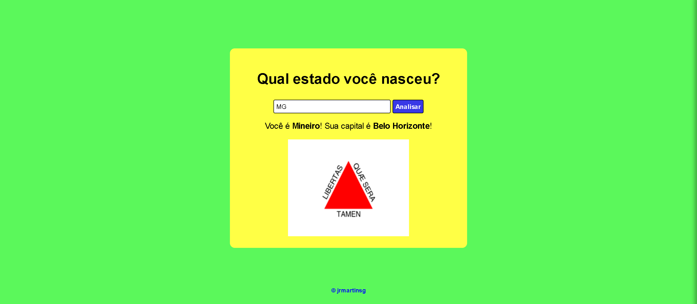
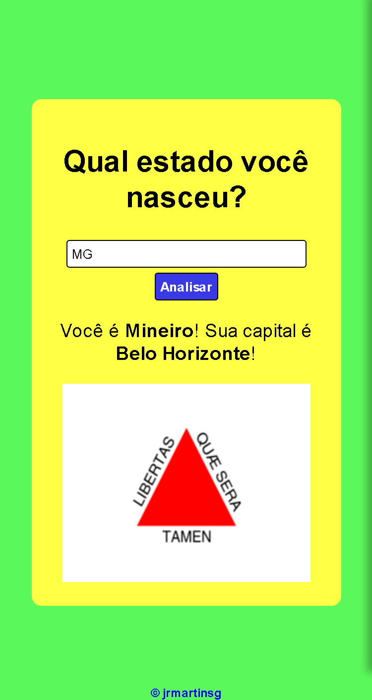

<h1>Estados Brasileiros</h1>

Projeto sobre os estados brasileiros e suas capitais! 
    Fiz este projeto com o intuito de colocar em prática meus conhecimentos em JavaScript!
    Neste projeto, basta colocar a sigla de seu estado e mostrará a bandeira do estado e sua capital!

<nav>
    <a href="#desktop">Desktop</a>
    <a href="#mobile">Mobile</a>
    <a href="https://estados-do-brasil.vercel.app/" target="_blank">Projeto</a>
    <a href="#tecnologias">Tecnologias</a>
</nav>

<h2 id="desktop">Desktop</h2>

<h2 id="mobile">Mobile</h2>

<a href="https://estados-do-brasil.vercel.app/" target="_blank"><button>Ver Projeto</button></a>

<h2 id="tecnologias">Tecnologias</h2>
<ul>
    <li>HTML5</li>
    <li>CSS3</li>
    <li>JavaScript</li>
</ul>

<h4>
    Feito por <a href="https://www.linkedin.com/in/jrmartinsg/" target="_blank">jrmartinsg</a>
</h4>